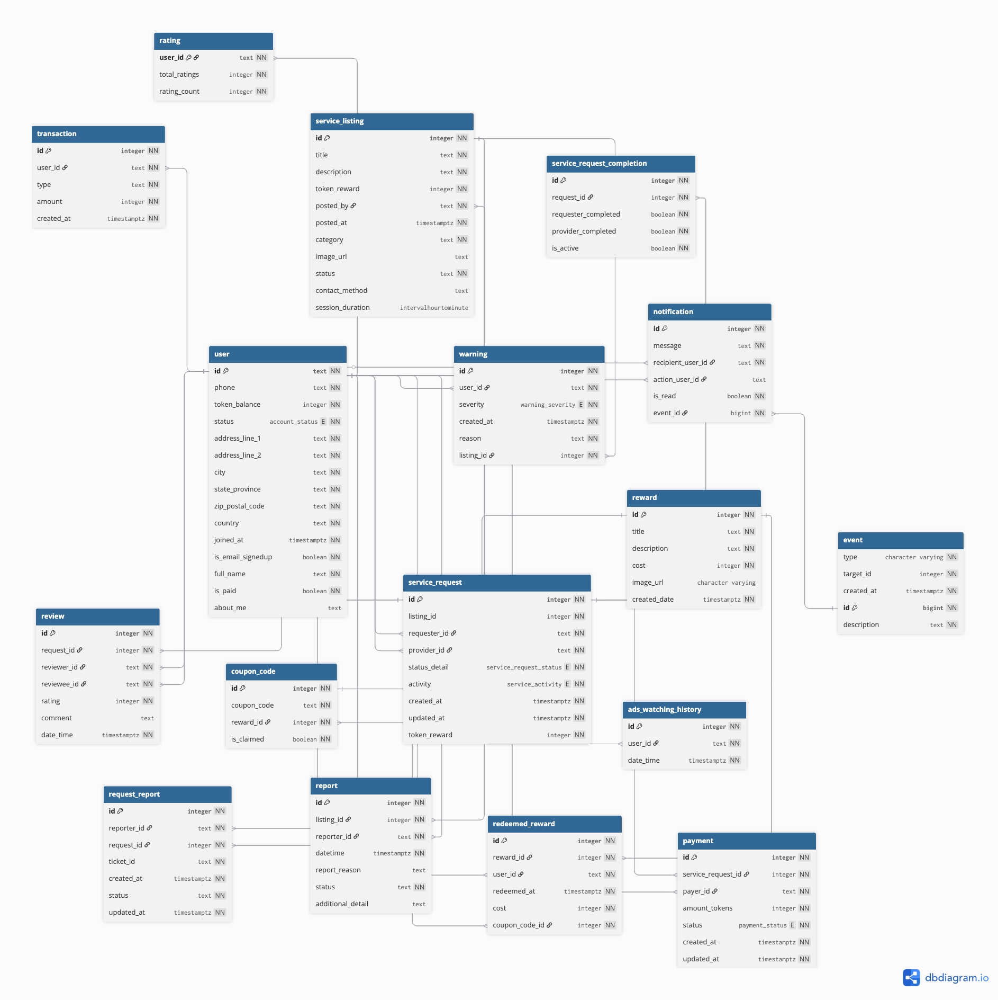

# Ontime

Developed as part of the Bachelor of Computer Science curriculum at Assumption University, this project demonstrates core competencies in backend development, system design, and software engineering principles.

# Overview

This project is a backend service built with Go that provides user authentication, database integration, and real-time notifications.

## Features

- User authentication and profile management
- PostgreSQL database integration
- Real-time notifications using Pusher
- RESTful API design

## Tech Stack

- **Backend**: Go
- **Database**: PostgreSQL (Neon DB)
- **Authentication**: Clerk
- **Real-time Updates**: Pusher
- **Environment**: Configurable via .env

## Getting Started

### Prerequisites

- Go 1.x
- PostgreSQL
- Pusher account (for real-time features)
- Clerk account (required for authentication)

### Installation

1. Clone the repository

   ```bash
   git clone https://github.com/set-kaung/SeniorProject1.git
   cd SeniorProject1
   ```

2. Install dependencies

   ```bash
   go mod tidy
   ```

3. Set up environment variables (see Configuration section)

4. Run the application
   ```bash
   make run
   ```
   or if you want to just build
   ```bash
   make build
   ```
   and
   ```bash
   ./bin/ontime
   ```

## Configuration

Create a `.env` file in the root directory with the following variables:

```
CLERK_SECRET_KEY=your_key
REMOTE_ORIGIN=your_frontend_origin
DBURL=your_connection_string
PORT=your_port
DAILY_ADS_LIMIT=your_limit
ONETIME_PAYMENT_TOKENS=your_onetime_tokens
PUSHER_APP_ID=your_app_id
PUSHER_KEY=your_key
PUSHER_SECRET=your_secret
PUSHER_CLUSTER=your_cluster
```

## Project Structure

```
+-- cmd/                  # Application entry points
+-- internal/             # Private application code
|   +-- domain/           # Business logic by domain
|   +-- helpers/          # Helper functions
|   +-- repository/       # Database access layer
+-- .env                  # Environment variables
+-- .gitignore            # Git ignore file
+-- go.mod                # Go module definition
+-- go.sum                # Go module checksums
+-- README.md             # This file
```

## Database ERD



## Environment Variables

- `CLERK_SECRET_KEY`: Authentication service secret key
- `REMOTE_ORIGIN`: CORS allowed origin
- `DBURL`: Database connection string
- `PORT`: Server port (default: 4096)
- `DAILY_ADS_LIMIT`: Maximum number of ads per day
- `ONETIME_PAYMENT_TOKENS`: Number of tokens awarded for one-time payment
- `PUSHER_*`: Pusher configuration for real-time features

## License

This project is proprietary.

## Contributors

- Set Kaung Lwin
